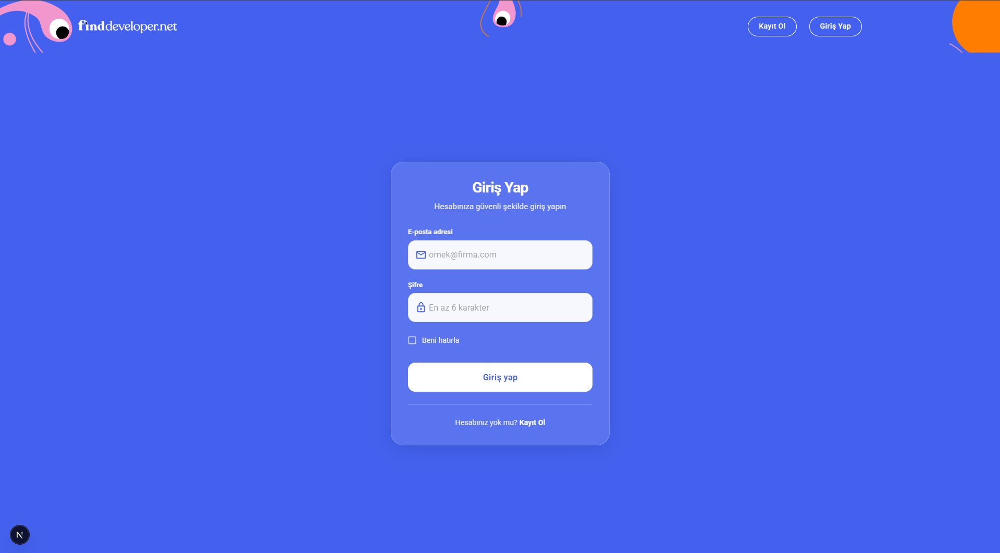
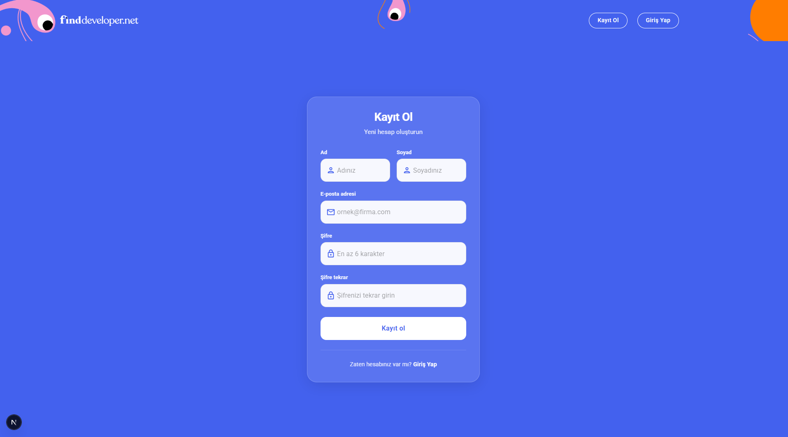
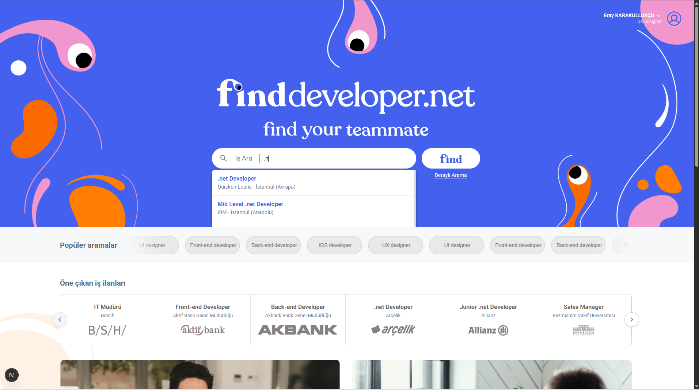
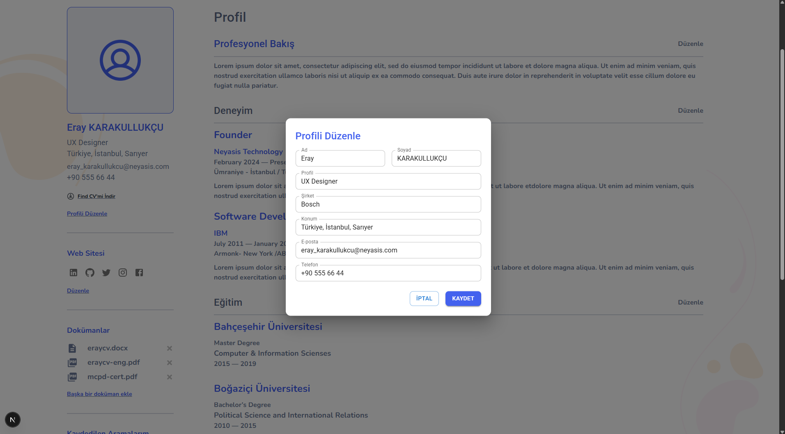
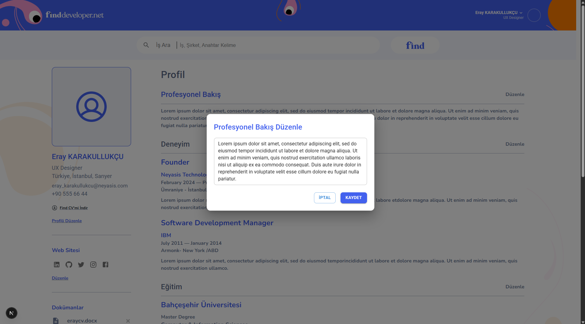
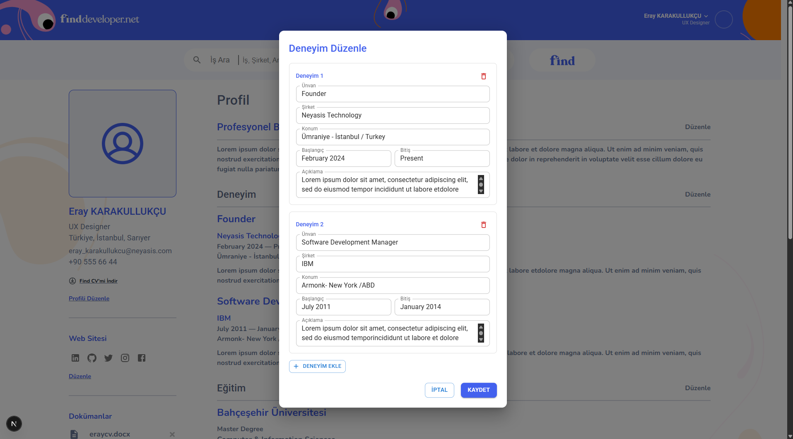
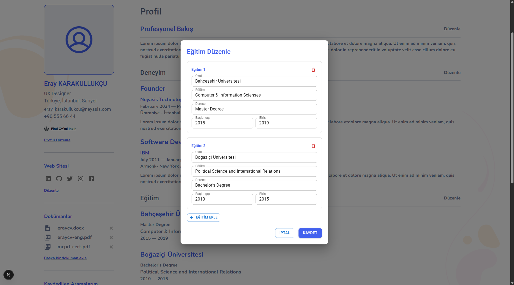
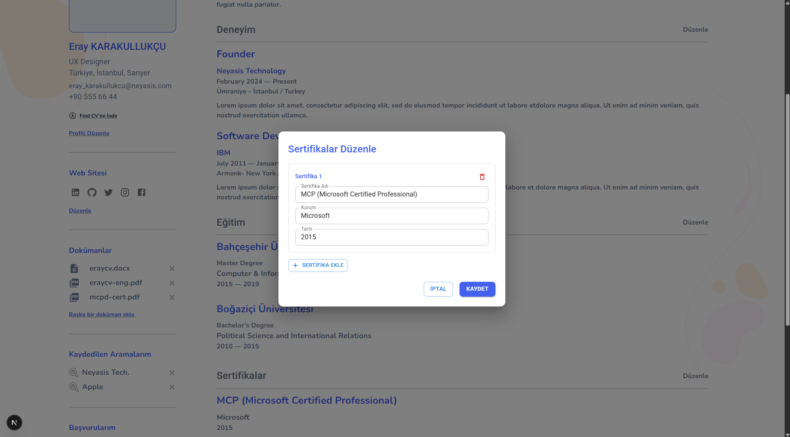
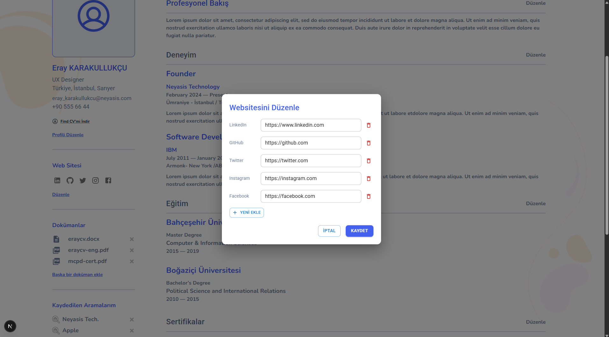
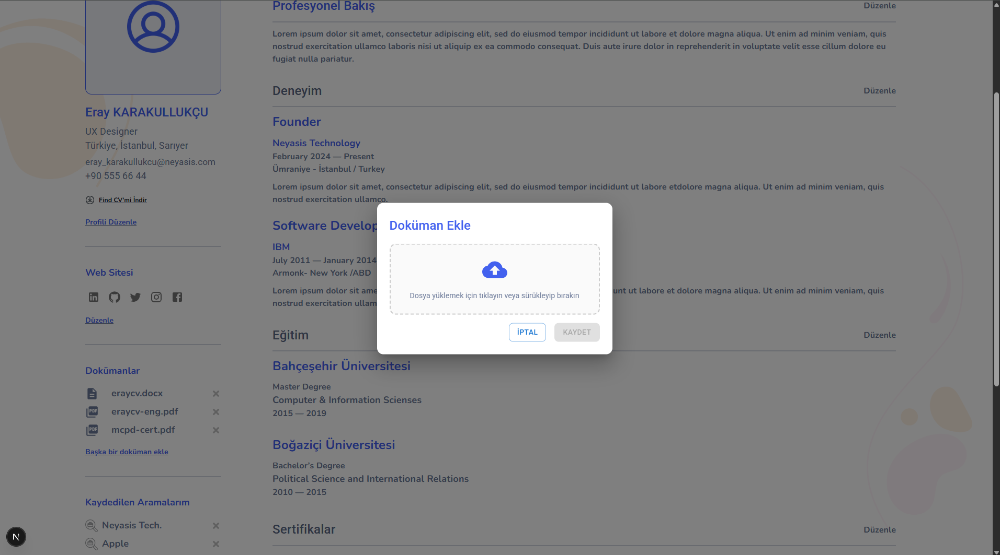

# finddeveloper.net

**find your teammate.**

finddeveloper.net, yazılım ve teknoloji alanında iş arayanlar ile işverenleri buluşturan bir kariyer ve iş ilanı platformudur. Kullanıcılar iş ilanlarını arayabilir, özgeçmiş ve profil bilgilerini yönetebilir; işverenler ise doğru yeteneklere ulaşabilir.

---

## Uygulama Hakkında

Platform, modern ve kullanıcı dostu bir arayüzle ana sayfada iş aramayı, popüler aramaları ve öne çıkan iş ilanlarını sunar. Kullanıcılar giriş yaparak kişisel profil sayfalarına erişebilir, deneyim, eğitim ve sertifikalarını düzenleyebilir; doküman yükleyebilir ve web siteleri / sosyal medya linklerini ekleyebilir. Türkçe ve İngilizce dil desteği mevcuttur.

---

## Ek Özellikler

Aşağıdaki özellikler projeye eklenmiş ve uygulama ile entegre edilmiştir:

### 1. Giriş ve Kayıt Sistemi (Login / Register)

- **Kayıt Ol:** Yeni kullanıcılar ad, soyad, e-posta ve şifre ile hesap oluşturabilir.
- **Giriş Yap:** Mevcut kullanıcılar e-posta ve şifre ile güvenli giriş yapabilir; "Beni hatırla" seçeneği desteklenir.
- Oturum bilgisi tarayıcıda saklanır; sayfa yenilense bile kullanıcı girişli kalır.


*Giriş sayfası*


*Kayıt sayfası*

### 2. Arama Sistemi

- **Aramalar tüm sayfalarda kullanılabilir.** Header (üst menü) üzerindeki arama alanı sayesinde ana sayfa, profil, arama sayfası vb. her yerden iş ilanı araması yapılabilir.
- Ana sayfada ve arama sayfasında **iş, şirket ve anahtar kelime** ile arama yapılabilir.
- **Detaylı arama** bağlantısı ile gelişmiş filtreleme imkânı sunulur.
- **Popüler aramalar** ve **öne çıkan iş ilanları** ile keşif kolaylaştırılır.
- Arama sonuçları sayfasında ilan listesi ve seçilen ilanın detayı gösterilir.


*Ana sayfa ve arama alanı*

### 3. Profil Düzenleme Modalları

Profil sayfasındaki her bölüm, kendi modal penceresi ile düzenlenebilir:

| Modal | Açıklama |
|-------|----------|
| **Profili Düzenle** | Ad, soyad, profil başlığı, şirket, konum, e-posta, telefon |
| **Profesyonel Bakış Düzenle** | Profesyonel özet metni (tek alan) |
| **Deneyim Düzenle** | Ünvan, şirket, konum, başlangıç/bitiş tarihleri, açıklama; birden fazla deneyim eklenebilir |
| **Eğitim Düzenle** | Okul, bölüm, derece, başlangıç/bitiş; birden fazla eğitim kaydı |
| **Sertifikalar Düzenle** | Sertifika adı, kurum, tarih; birden fazla sertifika |
| **Websitesini Düzenle** | LinkedIn, GitHub, Twitter, Instagram, Facebook vb. linkler; yeni satır eklenebilir |
| **Doküman Ekle** | PDF, DOC, DOCX yükleme; sürükle-bırak veya tıklayarak dosya seçimi |

Tüm modallarda **İptal** ve **Kaydet** butonları ile değişiklikler kaydedilir veya iptal edilir. Metinler Türkçe/İngilizce dil seçimine göre çeviri sistemi ile gösterilir.


*Profili Düzenle modalı*


*Profesyonel Bakış Düzenle modalı*


*Deneyim Düzenle modalı*


*Eğitim Düzenle modalı*


*Sertifikalar Düzenle modalı*


*Websitesini Düzenle modalı*


*Doküman Ekle modalı*

---

## Kullanılan Teknolojiler

| Alan | Teknoloji |
|------|-----------|
| **Framework** | Next.js 16 |
| **UI** | React 19, Material UI (MUI) v7, Emotion |
| **Dil** | TypeScript 5 |
| **Stil** | MUI Theme, CSS-in-JS (Emotion) |
| **Durum / Context** | React Context (Auth, Dil, Arama) |
| **Çeviri** | JSON tabanlı locale (TR/EN) |
| **Lint** | ESLint (eslint-config-next) |

---

## Mimari ve Proje Yapısı

- **Sayfalar:** `src/pages/` — Next.js sayfa bileşenleri (ana sayfa, giriş, kayıt, profil, arama).
- **Bileşenler:** `src/components/` — Ortak (Header, Footer, SearchBar, Button) ve sayfa özel (home, profile, search) bileşenler.
- **Context’ler:** `src/contexts/` — `AuthContext` (giriş/kayıt/kullanıcı), `LanguageContext` (dil/çeviri), `SearchContext` (arama/seçili ilan).
- **Çeviriler:** `src/locales/` — `tr.json` ve `en.json` ile çok dilli metinler.
- **Mock veri:** `src/mock/` — Örnek kullanıcı ve iş ilanı verileri (geliştirme/test için).
- **Stiller:** `src/styles/` — Global CSS ve MUI tema.

Uygulama, `_app.tsx` içinde `ThemeProvider` → `LanguageProvider` → `AuthProvider` → `SearchProvider` sırasıyla sarılarak tema, dil, kimlik doğrulama ve arama state’i tüm sayfalara sağlanır.

---

## Ekran Görüntüleri

Ekran görüntüleri aşağıdaki başlıklar altında kullanılabilir; görseller `assets` klasörüne konularak README’deki yollar ile eşleştirilmelidir.

| Dosya adı | İçerik |
|-----------|--------|
| `screenshot-login.png` | Giriş sayfası |
| `screenshot-register.png` | Kayıt sayfası |
| `screenshot-home-search.png` | Ana sayfa ve arama |
| `screenshot-modal-edit-profile.png` | Profili Düzenle modalı |
| `screenshot-modal-professional.png` | Profesyonel Bakış Düzenle modalı |
| `screenshot-modal-experience.png` | Deneyim Düzenle modalı |
| `screenshot-modal-education.png` | Eğitim Düzenle modalı |
| `screenshot-modal-certificates.png` | Sertifikalar Düzenle modalı |
| `screenshot-modal-websites.png` | Websitesini Düzenle modalı |
| `screenshot-modal-document.png` | Doküman Ekle modalı |

Görselleri proje kökünde `assets` klasörüne yukarıdaki dosya adlarıyla kopyalayın. Örnek: **Ana sayfa ve arama** → `./assets/screenshot-home-search.png`

---

## Test İçin Giriş Bilgileri

Uygulamayı test ederken aşağıdaki hesap ile giriş yapabilirsiniz:

| Alan | Değer |
|------|--------|
| **E-posta** | `eray_karakullukcu@neyasis.com` |
| **Şifre** | `123456` |

Bu bilgilerle giriş yapıldıktan sonra profil sayfasına giderek tüm profil düzenleme modallarını ve arama sayfasını test edebilirsiniz.

---

## Kurulum ve Çalıştırma

```bash
# Bağımlılıkları yükle
npm install

# Geliştirme sunucusunu başlat
npm run dev
```

Tarayıcıda [http://localhost:3000](http://localhost:3000) adresini açarak uygulamayı kullanabilirsiniz.

```bash
# Production build
npm run build
npm start
```

---

*finddeveloper.net — find your teammate.*
